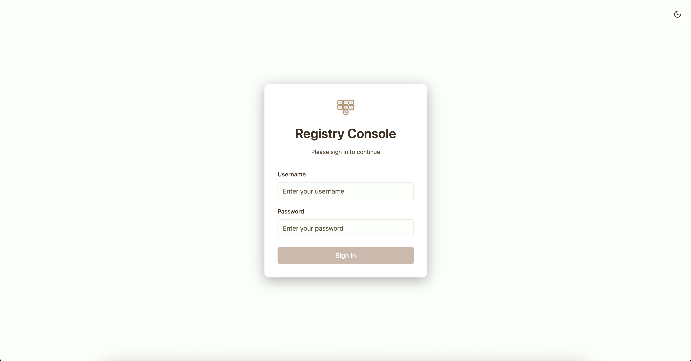
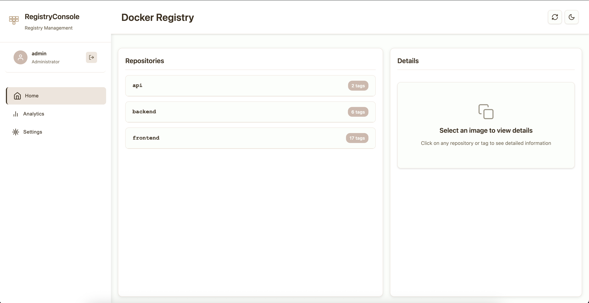
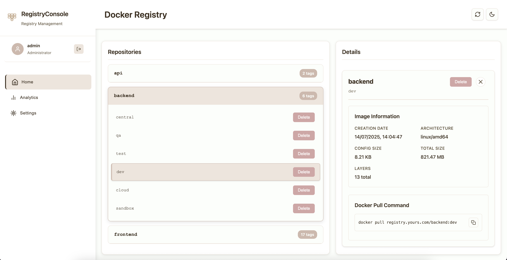
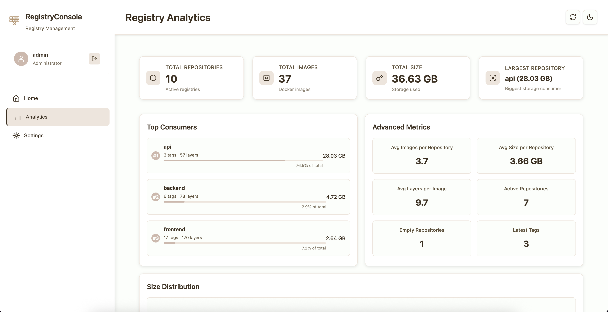

#  RegistryConsole

[](https://hub.docker.com/r/rubenmacedobarbosa/registry-console)
[](https://github.com/rtmmbarbosa/registry-console/actions)
[](https://github.com/rtmmbarbosa/registry-console/blob/main/LICENSE)
[](https://hub.docker.com/r/rubenmacedobarbosa/registry-console)

> **♪ Vibe Coding Project**  
> This tool was developed during a collaborative vibe coding session to improve and facilitate private Docker registry management. Created by Ruben Barbosa and GitHub Copilot through experimental exploration of modern web technologies and registry APIs.

Modern web interface for Docker Registry management with authentication, environment-based configuration, and comprehensive security features - perfect for production deployments and containerized environments.

## 🚀 Quick Start with Docker

### Docker Hub (Recommended)
```bash
docker run -d \
  --name registry-console \
  -p 3000:3000 \
  -e REGISTRY_URL=https://registry-1.docker.io \
  -e REGISTRY_NAME="Docker Hub" \
  rubenmacedobarbosa/registry-console:latest
```

### Multi-Architecture Support
Available for `linux/amd64` and `linux/arm64` platforms.

## ▸ Features

- **Authentication**: Login system with session management
- **Repository Management**: View and manage Docker repositories
- **Tag Management**: List and manage image tags
- **Image Deletion**: Remove images with confirmation dialogs
- **Auto-refresh**: Configurable data refresh intervals
- **Simple Statistics**: View basic usage metrics

## ▸ Screenshots

<div align="center">

### Login Interface


### Repository Management


### Image Details & Actions


### Analytics Dashboard


</div>

## ◦ Project Structure

```
registry_ui/
├── server.js              # Main Express server
├── package.json           # Dependencies and scripts
├── Dockerfile             # Container configuration
├── docker-compose.yml     # Multi-container setup
├── .env.example           # Environment variables template
├── middleware/
│   └── auth.js            # Authentication middleware
└── public/
    ├── index.html         # Main application interface
    ├── login.html         # Authentication page
    ├── script.js          # Frontend JavaScript
    ├── styles.css         # Application styles
    └── logo.svg           # Application logo
```

## ▸ Quick Start

### 1. Environment Configuration

```bash
# Clone and enter directory
git clone <repository-url>
cd registry_ui

# Copy and configure environment variables
cp .env.example .env
```

Edit `.env` with your registry details:
```env
# Registry Configuration
REGISTRY_URL=your-registry-url.com
REGISTRY_USERNAME=your_username
REGISTRY_PASSWORD=your_password
PORT=3000
NODE_ENV=production

# Authentication Configuration
AUTH_ENABLED=true
AUTH_USERNAME=admin
AUTH_PASSWORD=$2b$10$TYPp33iP8dHvzB8cwW.Mr.L4b6YbQ5ZcjFbDngCHz4dOnjAui3v8O
SESSION_SECRET=your-secret-key-change-in-production

### 3. Docker Deployment

```bash
# Using Docker Compose
docker-compose up -d

# Build and run manually
docker build -t registry-ui .
docker run -p 3000:3000 --env-file .env registry-ui
```

## ▸ Security

- **Authentication**: Configurable login system with session management
- **Route Protection**: All endpoints protected with authentication middleware
- **Environment Variables**: Secure credential management via `.env`

### Authentication Setup

1. **Enable Authentication**:
```env
AUTH_ENABLED=true
AUTH_USERNAME=admin
```

2. **Generate Password Hash**:
```bash
node -e "const bcrypt = require('bcrypt'); console.log(bcrypt.hashSync('your-password', 10));"
```

3. **Default Credentials**: 
   - Username: `admin`
   - Password: `admin` (change in production!)

## ▸ License

This project is licensed under the MIT License.

## ♪ About This Project

This project was created during a **vibe coding session** - a collaborative creative exploration of modern web technologies focused on improving private Docker registry management. Developed by **Ruben Barbosa** and **GitHub Copilot** through experimental prototyping and iterative discovery.

**Vibe Coding Characteristics:**
- ▸ Free experimentation with cutting-edge technologies
- ▸ Rapid prototyping and iterative development  
- ▸ Exploration of concepts without commercial pressure
- ▸ Focus on learning, discovery, and practical solutions
- ▸ Human-AI collaborative development

The goal was to create a practical tool that simplifies private registry management while exploring the boundaries of modern web development and AI-assisted coding.

---

*Modern interface for comprehensive Docker Registry management - A collaborative vibe coding exploration.*
